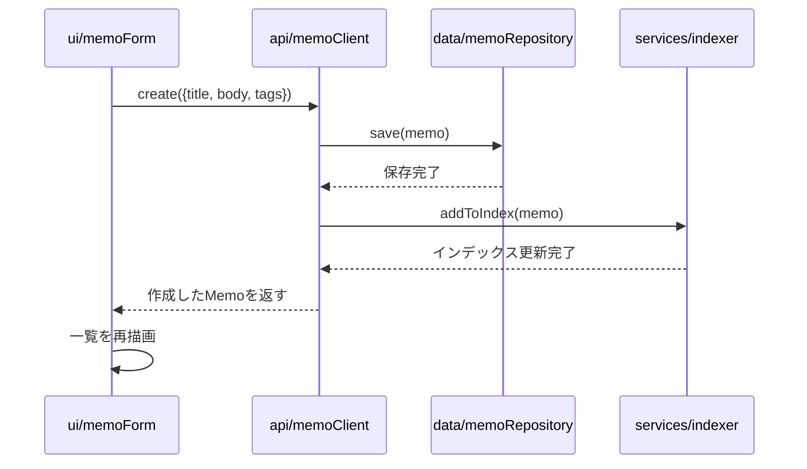
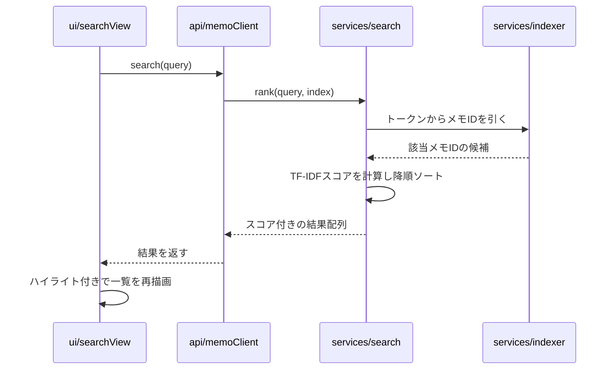

# 基本設計

[01-requirements.md](./01-requirements.md) の要件を、どう実現するかを定義する。
「なぜその設計にしたか」の判断理由は [03-decisions.md](./03-decisions.md) に分離してある。

## 画面設計

1画面構成(SPA)。要素は縦に3ブロック。

```
┌─────────────────────────────────────┐
│  Header: タイトル・一言サマリー          │
├─────────────────────────────────────┤
│  検索ボックス                          │
│  [_______________________] [検索]     │
│  タグフィルタ: [#ts] [#css] [#git] ... │
├─────────────────────────────────────┤
│  結果一覧 / 全メモ一覧                  │
│  ┌───────────────────────────┐   │
│  │ タイトル(ハイライト付き)         │   │
│  │ 本文の抜粋(マッチ箇所を強調)     │   │
│  │ #タグ #タグ          スコア: 0.82 │   │
│  └───────────────────────────┘   │
│  ...                                  │
├─────────────────────────────────────┤
│  + メモを追加(フォーム展開)             │
└─────────────────────────────────────┘
```

検索ボックスが空のときは全メモを新着順、入力があれば検索結果をスコア順に表示する。

## データモデル

```ts
interface Memo {
  id: string          // crypto.randomUUID()
  title: string
  body: string
  tags: string[]
  createdAt: number   // epoch ms
}
```

`tags`はタグを別エンティティに分けず、配列として直接埋め込む非正規化構造にしている(理由: [ADR-005](./03-decisions.md#adr-005-タグの正規化をしない))。
扱うエンティティは実質`Memo`1つのみのため、エンティティ間の関連を示すER図は作成していない(単一エンティティでは情報量がほぼゼロになるため)。

## 転置インデックスの構造

```ts
// トークン -> (メモID -> そのメモ内でのトークン出現回数)
type InvertedIndex = Map<string, Map<string, number>>
```

- キー: bi-gramトークン(例: `"型注"`, `"注釈"` ← 「型注釈」を分割)
- 値: そのトークンを含むメモIDと、メモ内での出現回数(TFの計算に使う)
- IDF(そのトークンが全体でどれだけ珍しいか)は検索時に `全メモ数 / トークンを含むメモ数` から都度算出する(メモ数が少ないため事前計算はしない)

## トークナイズ仕様

日英混在テキストを言語判定なしで扱うための正規化・分割ルール([ADR-002](./03-decisions.md#adr-002-日英混在テキストのトークナイズ方式)参照)。

1. **正規化**: `String.prototype.normalize('NFKC')` で全角/半角を統一し、`toLowerCase()`で大文字小文字を統一する
2. **分割**: 正規表現(`/[a-z0-9]+|[ぁ-んァ-ヶー一-龠]+/`相当)で、英数字のまとまりと、かな/カナ/漢字のまとまりを別パターンとして抽出する。1つの文字クラスにまとめると「TS型」のような英数字と日本語が連続する箇所が文字種をまたいだ1単語として抽出されてしまうため、パターンを分けている(実装時のテストで検出)。記号・空白・改行はまとまりの区切りとして扱い、トークンをまたがせない(コード中の`{}`や`.`でトークンが不自然に連結しないようにするため)
3. **bi-gram化**: 各まとまりを2文字スライド窓で分割する。例: `"型注釈"` → `["型注", "注釈"]`
4. **1文字の例外**: まとまりの長さが1文字の場合はbi-gramが作れないため、そのまま1トークンとして扱う(単漢字・単一英字での検索を可能にするため)

検索クエリも同じ関数でトークナイズしてから、転置インデックスに問い合わせる。

## ハイライト・抜粋の仕様

bi-gram一致は「単語単位の一致」ではないため、素朴に実装すると意味的に無関係な範囲までハイライトされうる。以下の方式で表示範囲を決める。

1. クエリをトークナイズし、各トークン(2文字)が本文中に出現する文字位置をすべて探す
2. 出現位置の区間([開始, 終了])の集合を作り、隣接・重複する区間をマージして1つながりのハイライト区間にする
3. 本文が長い場合は、最初のハイライト区間を中心に前後一定文字数を切り出し、両端に必要なら`…`を付けて抜粋として表示する

## 疑似API仕様

サーバーを持たないが、将来的にAPIへ切り出すことを想定したインターフェースを `api/` 層に定義する。

| 関数 | 相当するHTTP API | 役割 |
|---|---|---|
| `memoApi.list()` | `GET /memos` | 全メモ取得 |
| `memoApi.create(input)` | `POST /memos` | メモ登録 |
| `memoApi.remove(id)` | `DELETE /memos/:id` | メモ削除 |
| `memoApi.search(query)` | `GET /search?q=...` | 検索実行、スコア順の結果を返す |

`api/`層は`data/`層(localStorage)と`services/`層(トークナイズ・検索)を呼び出すだけで、
ロジック自体は持たない。将来サーバーAPIに差し替える際は、`api/`層の実装だけを
`fetch()`ベースのものに置き換えれば、`ui/`層は無変更で済む設計にする。

## 処理フロー: メモ登録



## 処理フロー: 検索



## タグ絞り込みの仕様(F-06)

- 全メモの`tags`を集計し、重複を除いた一覧をタグフィルタとして表示する(登録済みタグ以外は選べない = 存在しないタグで検索して0件になる事故を防ぐ)
- 選択は同時に1つまで。選択中のタグをもう一度クリックすると解除する(トグル式)。複数タグのAND/OR選択は、今回の想定データ量(数十〜数百件)では価値に対して実装・UIの複雑さが見合わないため見送る
- タグ選択とキーワード検索は併用できる。処理順序は「まずキーワードで検索(またはキーワードがなければ全件)→その結果をタグでさらに絞り込む」。理由は[ADR-008](./03-decisions.md#adr-008-タグ絞り込みとキーワード検索の組み合わせ方)を参照

## キーボード操作とフィードバックの仕様(F-10, F-11)

- ページ読み込み時、検索ボックスに自動フォーカスする
- 入力欄にフォーカスしていない状態で`/`を押すと検索ボックスにフォーカスする(入力欄にフォーカス中は素通しし、通常の`/`入力を妨げない)
- 検索ボックスにフォーカスがある状態で`Esc`を押すと、入力を空にして全件表示に戻す
- メモの保存・削除が成功したら、画面下部に2秒程度のトースト通知(`メモを保存しました` / `メモを削除しました`)を表示する。エラーではなく完了の手応えを返すためのもので、消えても操作結果(一覧の変化)自体は残る

## ディレクトリとレイヤーの対応

| レイヤー | 責務 | 要件との対応 |
|---|---|---|
| `ui/` | DOM描画、イベントハンドリング | F-01〜F-06, F-10, F-11の画面表現 |
| `api/` | 呼び出しインターフェースの統一 | 将来のサーバー化に備えた境界 |
| `services/` | トークナイズ・インデックス構築・スコアリング | F-03, F-04, N-02, N-03, N-04 |
| `data/` | localStorageへの永続化、サンプルデータ | F-07 |
